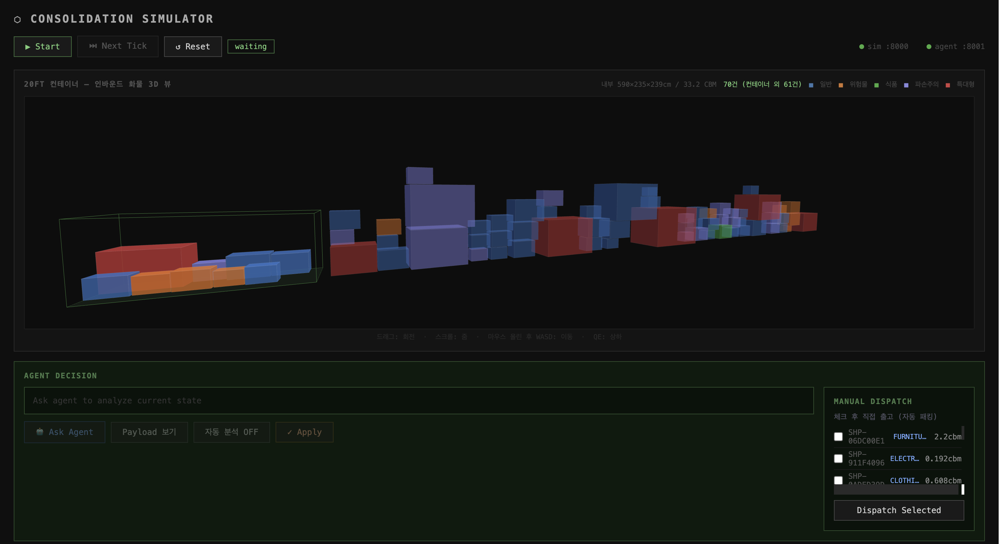
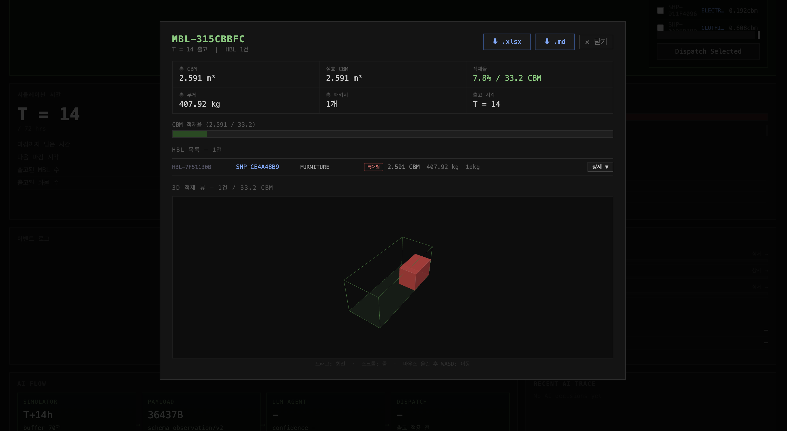

# LCL Simulator

LCL (Less than Container Load) 컨테이너 통합 시뮬레이션을 위한 프로젝트입니다. 에이전트 기반 시뮬레이션과 웹 인터페이스를 제공합니다.

## 프로젝트 구조

- `agents/`: 에이전트 서버 및 클라이언트 코드
- `server/`: 시뮬레이션 서버 (FastAPI 기반, 포트 8000)
- `web/`: 웹 인터페이스 (HTML/CSS/JavaScript)

## 설치 및 실행

### 요구사항
- Python 3.8 이상
- FastAPI, Uvicorn, Pydantic 등 (의존성 패키지 설치 필요)

### 실행 방법
1. 가상환경 활성화 (선택사항):
   ```bash
   python -m venv .venv
   source .venv/bin/activate  # macOS/Linux
   ```

2. 의존성 설치:
   ```bash
   pip install fastapi uvicorn pydantic
   ```
   (추가 의존성이 필요할 수 있음: simulator_v1 등)

3. 실행:

   | 명령어 | 설명 |
   |--------|------|
   | `python run.py sim` | 시뮬레이션 단독 실행 (터미널 결과 출력) |
   | `python run.py server` | 시뮬레이션 서버 실행 (`:8000`, 환경/state/dispatch 제공) |
   | `python run.py agent` | LLM AI Agent 서버 실행 (`:8001`, `/decide` 제공) |
   | `python run.py all` | 두 서버 동시 실행 (Ctrl+C로 종료) |

4. 웹 브라우저에서 [http://localhost:8000](http://localhost:8000) 접속하여 시뮬레이션 인터페이스 사용.

## 스크린샷

### 메인 시뮬레이터 화면 — 3D 컨테이너 적재 뷰



20FT 컨테이너(내부 590×235×239 cm / 33.2 CBM) 내 화물을 실시간 3D로 시각화합니다.

- 상단: 시뮬레이터 컨트롤 (Start / Next Tick / Reset) 및 서버 상태 표시 (sim :8000 / agent :8001)
- 중앙 3D 뷰: 컨테이너 안에 적재된 화물을 카테고리별 색상으로 표시 (일반/위험물/식품/파손주의/특대형)
- 우측 MANUAL DISPATCH: 개별 Shipment를 선택 후 수동 출하 가능
- 하단 AGENT DECISION: LLM 에이전트에게 현재 상태 분석을 요청하거나 자동 분석 ON/OFF 전환

### MBL 출고 상세 팝업 — 적재 현황 및 3D 뷰



특정 MBL을 선택하면 출고 상세 모달이 열립니다.

| 항목 | 예시 |
|------|------|
| 총 CBM / 실효 CBM | 2.591 m³ |
| 적재율 | 7.8% / 33.2 CBM |
| 총 무게 | 407.92 kg |
| 총 패키지 | 1개 |
| 출고 시간 | T = 14 |

- HBL 목록에서 개별 Shipment의 상세 정보(CBM, 무게, 특대형 여부 등)를 확인할 수 있습니다.
- 3D 뷰에서 해당 MBL에 포함된 화물의 컨테이너 내 배치를 시각적으로 확인합니다.
- `.xlsx` / `.md` 버튼으로 출고 내역을 즉시 다운로드할 수 있습니다.

> **이미지 파일 위치**: 위 스크린샷은 `docs/screenshots/` 폴더에 저장하세요.
> - `docs/screenshots/simulator_main.png` — 메인 시뮬레이터 전체 화면
> - `docs/screenshots/mbl_dispatch_detail.png` — MBL 출고 상세 팝업

---

## 사용법

- 시뮬레이션 서버는 화물 도착, 버퍼 상태, dispatch 적용만 담당합니다.
- 에이전트 서버는 현재 state를 입력받아 LLM 기반으로 출하 결정을 반환합니다.
- 웹 인터페이스의 `Ask Agent`는 에이전트 서버의 `/decide`를 호출합니다.

## 다중 컨테이너 설정 (`max_active_containers`)

기본값은 `1`(컨테이너 1개)입니다. 이 값을 늘리면 시뮬레이션이 여러 컨테이너 슬롯을 동시에 열고 화물을 병렬로 적재합니다.

### 동작 방식

```
버퍼 (미배정 화물)
    ↓ DISPATCH (close: false)
슬롯 A ─── 적재 중 ──→ cutoff 또는 꽉 참 → MBL 생성
슬롯 B ─── 적재 중 ──→ cutoff 또는 꽉 참 → MBL 생성
슬롯 C ─── 적재 중 ──→ ...
```

- **슬롯 오픈**: DISPATCH 시 `close: false` 플래그를 전달하면 MBL 즉시 생성 없이 슬롯을 유지합니다.
- **슬롯 닫기(MBL 생성)**: `close: true`(기본값) 또는 cutoff 도달 시 자동으로 MBL이 생성됩니다.
- **슬롯 꽉 참**: 슬롯의 effective CBM이 usable CBM을 초과하면 자동으로 닫힙니다.
- **슬롯 한도 초과**: 열린 슬롯 수가 `max_active_containers`에 도달하면 가장 채워진 슬롯을 먼저 닫고 새 슬롯을 엽니다.

### 1. Python 코드에서 변경

```python
from simulator_v1.env import EnvConfig, ConsolidationEnv

config = EnvConfig(
    max_active_containers=3,   # 슬롯 최대 3개 동시 운영
    max_cbm_per_mbl=33.2,
    sim_duration_hours=72,
)
env = ConsolidationEnv(config)
```

### 2. 웹 대시보드 (API)에서 변경

시뮬레이션 시작 시 `POST /simulation/start` 요청 body에 `max_active_containers`를 포함합니다.

```bash
curl -X POST http://localhost:8000/simulation/start \
  -H "Content-Type: application/json" \
  -d '{
    "seed": 42,
    "sim_duration_hours": 72,
    "max_cbm_per_mbl": 33.2,
    "max_active_containers": 3
  }'
```

웹 UI에서는 `max_active_containers > 1`이거나 열린 슬롯이 있을 때 **Active Containers** 패널이 자동으로 표시됩니다.

### 3. 에이전트에서 슬롯 배정

DISPATCH action의 각 MBL plan에 `close`와 `slot_id` 필드를 추가합니다.

```python
# 슬롯에 배정하고 열어두기 (MBL 미생성)
Action.dispatch(
    agent_id="my-agent",
    mbls=[{
        "shipment_ids": ["SHP-001", "SHP-002"],
        "slot_id": "SLOT-ABC123",   # 없으면 새 슬롯 자동 생성
        "close": False,             # True(기본)면 즉시 MBL 생성
    }]
)

# 슬롯 닫기 (MBL 생성)
Action.dispatch(
    agent_id="my-agent",
    mbls=[{
        "shipment_ids": ["SHP-003"],
        "slot_id": "SLOT-ABC123",
        "close": True,
    }]
)
```

`close`를 생략하면 기본값 `True`로 동작하므로 기존 에이전트 코드는 수정 없이 그대로 사용할 수 있습니다.

### 4. Observation에서 슬롯 상태 읽기

`max_active_containers > 1`이면 Observation에 `containers` 필드가 포함됩니다.

```python
obs = env._build_observation().to_dict()

for slot in obs["containers"]:
    print(slot["slot_id"])              # "SLOT-4D62CF"
    print(slot["fill_rate"])            # 0.45 (45%)
    print(slot["current_effective_cbm"]) # 13.4
    print(slot["usable_cbm"])           # 29.88
    print(slot["shipment_ids"])         # ["SHP-001", ...]
```

### 설정 값 가이드

| `max_active_containers` | 적합한 상황 |
|------------------------|------------|
| `1` (기본) | 단일 컨테이너 단위 운영, 기존 에이전트 호환 |
| `2 ~ 3` | 카테고리 분리 적재 (예: 위험물 / 일반화물 동시 운영) |
| `4 이상` | 다출발 스케줄 또는 고물동량 환경 |

---

## LLM 연결 설정

에이전트 서버는 LLM SDK와 API 키가 모두 준비되어야 실제 LLM으로 동작합니다.
설정이 없으면 서버는 실행되지만 `fallback mode`로 동작합니다.

### 1. SDK 설치

사용할 provider에 맞는 패키지를 설치합니다.

```bash
pip install anthropic
pip install openai
pip install google-generativeai
```

필요한 provider만 설치해도 됩니다.

### 2. 환경변수 설정

#### Anthropic 사용 예시

```bash
export LLM_PROVIDER=anthropic
export ANTHROPIC_API_KEY=YOUR_KEY
export LLM_MODEL=claude-sonnet-4-6
```

#### OpenAI 사용 예시

```bash
export LLM_PROVIDER=openai
export OPENAI_API_KEY=YOUR_KEY
export LLM_MODEL=gpt-4o
```

#### Google Gemini 사용 예시

```bash
export LLM_PROVIDER=google
export GOOGLE_API_KEY=YOUR_KEY
export LLM_MODEL=gemini-1.5-flash
```

추가로 기본 컨테이너 타입을 지정할 수 있습니다.

```bash
export DEFAULT_CONTAINER_TYPE=40GP
```

### 3. Agent 서버 실행

```bash
python run.py agent
```

또는 시뮬레이터와 함께 실행:

```bash
python run.py all
```

### 4. 연결 확인

아래 endpoint로 실제 LLM 연결 여부를 확인할 수 있습니다.

```bash
curl http://localhost:8001/health
```

정상적으로 LLM이 연결되면 아래처럼 보입니다.

```json
{
  "ok": true,
  "agent": "llm-ai",
  "ai_agent_available": true,
  "llm_enabled": true,
  "ai_fallback_mode": false
}
```

반대로 아래 상태면 에이전트 객체는 생성됐지만 실제 LLM은 연결되지 않은 상태입니다.

```json
{
  "ok": true,
  "agent": "llm-ai",
  "ai_agent_available": true,
  "llm_enabled": false,
  "ai_fallback_mode": true
}
```

이 경우에는 보통 다음 중 하나입니다.

- API 키가 설정되지 않음
- 해당 provider SDK가 설치되지 않음
- `LLM_PROVIDER`와 API 키 종류가 맞지 않음

---

## Olist 실제 데이터 기반 물동량 시뮬레이션

[Olist Brazilian E-Commerce 데이터셋](https://www.kaggle.com/datasets/olistbr/brazilian-ecommerce)의 CSV 파일 분포를 활용하여
실제 카테고리 비율과 물동량 패턴으로 시뮬레이션을 실행할 수 있습니다.

### 필요 파일

`archive/` 폴더에 아래 CSV 파일이 있어야 합니다.

```
archive/
├── olist_orders_dataset.csv
├── olist_order_items_dataset.csv
├── olist_products_dataset.csv
└── product_category_name_translation.csv
```

### 추가 의존성 설치

```bash
pip install pandas numpy
```

### Python 코드에서 사용

```python
from simulator_v1.run import run_olist

# 기본 실행 — Olist 카테고리 비율로 시간당 총 6건 도착
results = run_olist("../archive", total_rate=6.0)

# 물동량 규모 조정 (시간당 총 도착 건수만 변경, 비율은 Olist 분포 유지)
results = run_olist("../archive", total_rate=10.0, sim_duration_hours=168)

# CBM 파라미터도 Olist 실측 치수 기반으로 교체
results = run_olist("../archive", total_rate=6.0, use_olist_cbm=True)
```

### CLI에서 사용

```bash
# lcl_simulator/ 디렉터리에서 실행
python -m simulator_v1.run --olist ../archive
python -m simulator_v1.run --olist ../archive --total-rate 10.0 --hours 168
python -m simulator_v1.run --olist ../archive --olist-cbm --save outputs/olist
```

| 옵션 | 기본값 | 설명 |
|------|--------|------|
| `--olist ARCHIVE_DIR` | (없음) | Olist CSV 폴더 경로. 미지정 시 기본 통계 기반 실행 |
| `--total-rate FLOAT` | `6.0` | 시간당 총 도착 화물 수 |
| `--olist-cbm` | `False` | Olist 실측 치수 → LCL 환산 CBM 파라미터 사용 |
| `--seed INT` | `42` | 난수 시드 |
| `--hours INT` | `72` | 시뮬레이션 기간 (시간) |
| `--save DIR` | `outputs` | 결과 JSON 저장 폴더 |

### Olist에서 추출되는 카테고리 비율

Olist 데이터(110,197건) 기준 ItemType별 비율 (total_rate=6.0 기준):

| ItemType | 시간당 도착 | 비율 | 포함 Olist 카테고리 |
|----------|------------|------|---------------------|
| CLOTHING | 2.82 /hr | 47% | fashion_*, bed_bath_table, housewares, home_confort |
| ELECTRONICS | 1.40 /hr | 23% | electronics, computers, telephony 등 |
| COSMETICS | 1.06 /hr | 18% | health_beauty, perfumery 등 |
| AUTO_PARTS | 0.49 /hr | 8% | auto, construction_tools_*, home_construction |
| FURNITURE | 0.27 /hr | 5% | furniture_* (실제 가구류만), office_furniture |
| MACHINERY | 0.17 /hr | 3% | small_appliances, home_appliances 등 |
| FOOD_PRODUCTS | 0.09 /hr | 2% | food, drinks 등 |
| CHEMICALS | 0.04 /hr | 1% | agro_industry, industry_commerce |

> **FURNITURE 분류 기준**: `bed_bath_table`(침구·수건류)·`housewares`(소형 생활용품)은 개별 CBM이 작아 FURNITURE 버킷의 CBM 분포를 왜곡하므로 CLOTHING으로 분리했습니다. FURNITURE에는 실제 부피가 큰 가구류(`furniture_*`, `office_furniture`, `kitchen_dining_*`)만 포함합니다.

### 데이터 출처

Olist Brazilian E-Commerce Public Dataset

- **출처**: [https://www.kaggle.com/datasets/olistbr/brazilian-ecommerce](https://www.kaggle.com/datasets/olistbr/brazilian-ecommerce)
- **제공**: Olist (브라질 이커머스 플랫폼)
- **라이선스**: CC BY-NC-SA 4.0
- **기간**: 2016년 9월 ~ 2018년 8월 (약 17,000시간)
- **규모**: 배송 완료 주문 기준 약 110,000건의 주문 아이템

### 보정 방식 참고

| 항목 | 설명 |
|------|------|
| **도착률** | Olist 주문 타임스탬프에서 카테고리별 시간당 건수 계산 후 `total_rate`로 정규화 |
| **CBM (기본)** | 기존 학술 기반 LCL 로그 정규 파라미터 유지 |
| **CBM (`--olist-cbm`)** | Olist 실측 상품 치수에 LCL 상업 화물 스케일 팩터 적용 (예: ELECTRONICS ×72) |

---

## RL 기반 Multi-Agent 최적화 (AAMAS)

`rl/` 모듈은 MAPPO(Multi-Agent PPO) 기반의 협력형 강화학습 에이전트를 제공합니다.

### 아키텍처

```
TimingAgent   ─ WAIT / DISPATCH 결정 (Discrete 2)
PlanningAgent ─ 적재율 목표 선택 [40%, 50%, 60%, 70%, 80%] (Discrete 5)
CentralCritic ─ 학습 시 joint state로 공유 가치 추정 (CTDE)
```

두 에이전트는 동일한 글로벌 관찰을 공유하며 협력 보상(shared reward)으로 함께 학습합니다.

#### 관찰 공간

| 구성 | 차원 | 설명 |
|------|------|------|
| 글로벌 feature | 8 | 시간, 버퍼 요약, SLA 위험도 |
| 화물 set feature | 50 × 19 | per-shipment (item type 8 + category 5 + 연속 6) |

화물 집합은 **Multi-head Self-Attention (Set Transformer)** 으로 인코딩하여 순서 불변성과 가변 길이를 처리합니다.

#### 보상 함수

```
r = -W_hold × (보관비) - W_late × (SLA 위반 패널티) + W_fill × (충전율 보너스) - W_compat × (호환성 위반)
```

### 의존성 설치

```bash
pip install torch
```

### 학습

```bash
# 기본 학습 (2000 에피소드)
python run.py rl-train

# 설정 변경
python run.py rl-train -- --episodes 5000 --lr 1e-4 --device cuda

# 체크포인트에서 이어서 학습
python run.py rl-train -- --resume checkpoints/mappo_ep01000.pt
```

학습 결과:
- `checkpoints/mappo_best.pt` — 평가 기준 최고 성능 체크포인트
- `checkpoints/mappo_final.pt` — 학습 완료 체크포인트
- `checkpoints/training_log.json` — 에피소드별 지표 로그

### 평가 (Baseline 비교)

```bash
# 전체 에이전트 비교 (rule-based 3종 + MAPPO)
python run.py rl-eval -- --checkpoint checkpoints/mappo_best.pt --episodes 20
```

비교 대상:

| 에이전트 | 전략 |
|---------|------|
| `time_based` | 24h 주기 고정 출고 |
| `threshold` | effective CBM ≥ 8.0 시 출고 |
| `hybrid` | SLA + CBM + 최대 대기시간 혼합 |
| `mappo` | 학습된 MAPPO (TimingAgent + PlanningAgent) |

결과는 `eval_results.json`에 저장됩니다.

### RL 에이전트 서버

학습된 모델을 서버로 실행하면 기존 시뮬레이션 서버(`:8000`)와 동일한 인터페이스로 연동됩니다.

```bash
python run.py rl-server -- --checkpoint checkpoints/mappo_best.pt --port 8003
```

```bash
# 시뮬레이션 서버 + RL 에이전트 동시 실행
python run.py all-rl
```

#### 엔드포인트

| Method | Endpoint | 설명 |
|--------|----------|------|
| `POST` | `/decide` | 행동 결정 (기존 에이전트 서버 호환) |
| `GET`  | `/status` | 서버 상태 + 모델 정보 |
| `POST` | `/load_model` | 런타임 중 모델 교체 |
| `GET`  | `/stats` | 누적 dispatch/wait 통계 |
| `GET`  | `/health` | 헬스체크 |

```bash
# 헬스체크
curl http://localhost:8003/health

# 행동 결정
curl -X POST http://localhost:8003/decide \
  -H "Content-Type: application/json" \
  -d '{"observation": <obs_dict>}'
```

### 파일 구조

```
rl/
├── features.py      — Observation → feature vector (Attention 인코더용)
├── reward.py        — Step reward 및 에피소드 return 계산
├── env_wrapper.py   — MultiAgentLCLEnv (Gym 호환 step() 인터페이스)
├── network.py       — ShipmentSetEncoder + Actor + CentralCritic
├── mappo.py         — MAPPO 알고리즘 (GAE-λ + PPO-clip + RolloutBuffer)
├── trainer.py       — 학습 루프 + 체크포인트 + JSON 로그
├── evaluate.py      — 에이전트 비교 평가 (논문 Table 생성)
├── rl_agent.py      — AgentBase 호환 추론 에이전트
├── server.py        — FastAPI RL 서버 (:8003)
└── train.py         — 학습 CLI 진입점
```

---

## 기여

이슈나 풀 리퀘스트를 통해 기여해주세요.

## 라이선스

(라이선스 정보 추가)
